# Pickleheads — Product Requirements Document (Reverse-Engineered Feature Specification)

> **Document type:** Competitive product teardown / feature PRD
> **Subject:** [Pickleheads](https://www.pickleheads.com/) — operated by Dink Technologies, Inc. (© 2026)
> **Method:** Hands-on walkthrough of the live, logged-in web application plus inspection of the site's SEO and technical surface (robots.txt, sitemaps, rendered metadata, structured data, network stack).
> **Author:** Product research, captured 2026-06-24
> **Scope:** Web application. The native iOS/Android apps are referenced where the web app defers to them, but were not independently audited.

---

## 1. Executive Summary

Pickleheads is the self-described **"#1 platform for pickleball"** — a two-sided marketplace and community network that connects recreational pickleball **players** with **places to play**, **games to join**, **coaches to learn from**, and **organizers** who run those games. It simultaneously serves as the leading SaaS toolkit for the people who run pickleball — round-robin hosts, league and ladder organizers, and the facilities/rec-centers that host them.

The product is best understood as four overlapping surfaces stitched into one platform:

1. **A discovery directory** — a worldwide, crowdsourced database of pickleball courts, open-play sessions, groups, and coaches, indexed by an enormous programmatic-SEO engine (the site advertises ~24,700 locations across ~9,800 cities, and its sitemaps expose **24,192 court pages, 9,692 city pages, 750 state pages, and 145 country pages**).
2. **A social/community network** — player profiles, skill ratings (with DUPR integration), follows, groups, chat, lists, and game RSVPs.
3. **An organizer SaaS** — round robins, leagues, ladders, and mini-tournaments with automated scheduling, waitlists, live standings, score entry, DUPR submission, and payment collection.
4. **A content + commerce arm** — editorial "how to play" guides, gear/paddle reviews (affiliate), a paddle-matching quiz, a merch store, and a coaching marketplace (powered by TeachMe.To).

Monetization is a four-tier subscription ladder — **Free, Plus ($12/yr, players), Pro ($14.99/mo, organizers), Ultra ($74.99/mo, facilities)** — supplemented by affiliate commerce, facility add-ons, and a clever "players subsidize the organizer" Plus-Power model. The platform reports **698,700 members** and **4.9 stars across 9,200+ app reviews**, and is endorsed by industry bodies including USA Pickleball, the International Association of Pickleball Facilities (IAPF), SFIA, and the Global Pickleball Federation.

This document inventories every major view, summarizes the feature set of each, rolls those up into a platform-wide feature summary, and then dissects the business model, SEO strategy, and technical architecture.

---

## 2. Product Vision, Positioning & Target Users

**Positioning statement (implicit):** *"Find pickleball near you, and run pickleball better."* The homepage hero is a single search box over the line **"Find pickleball near you,"** with a secondary CTA to **"organize a game."** That duality — *find* vs. *organize* — is the spine of the entire IA.

**Target user personas observed in the product:**

| Persona | What Pickleheads gives them | Monetized via |
|---|---|---|
| **New / casual player** | "How to play" guides, skill-rating quiz, court finder, open-play discovery | Free tier, affiliate gear, lessons |
| **Diehard / traveling player** | Skill-matched games, direct messaging, groups, Vacation Mode, advanced stats | **Plus** ($12/yr) |
| **Organizer / "Power Organizer"** | Round robins, leagues, ladders, mini-tournaments, waitlists, payments, DUPR | **Pro** ($14.99/mo) |
| **Facility / rec-center manager** | In-app leagues, unlimited everything, facility integrations & promotion | **Ultra** ($74.99/mo) |
| **Coach** | A "Get listed" lead-gen channel on court & lesson pages | TeachMe.To partnership |
| **Court owner / contributor** | Claim, edit, and verify court listings | Drives directory data + Ultra upsell |

The brand voice is playful (a cartoon pickle mascot, an "Ask me!" chat bubble, emoji-laden CTAs) layered over a genuinely deep utility product.

---

## 3. Information Architecture & Global Navigation

The persistent top navigation is organized around **four mega-menu buttons** plus search and account. Each menu is intent-segmented, and the right-hand promo rail in each cross-sells the relevant subscription tier (Play→Plus, Organize→Pro, Facilities→Ultra). This is a deliberate funnel: every primary nav target doubles as a tier-marketing surface.

| Nav button | Sub-destinations | Cross-sell |
|---|---|---|
| **Play** | Find courts · Find games · Find lessons · Find a new paddle | Pickleheads **Plus** |
| **Organize** | Leagues & ladders · Round robins · Mini-tournaments · Weekly games | Pickleheads **Pro** |
| **Facilities** | Get listed · Update a listing · Promote a facility | Pickleheads **Ultra** |
| **Shop** | Top paddles · Paddle quiz · Performance tees · Features & Plans | All three tiers |

### Play mega-menu
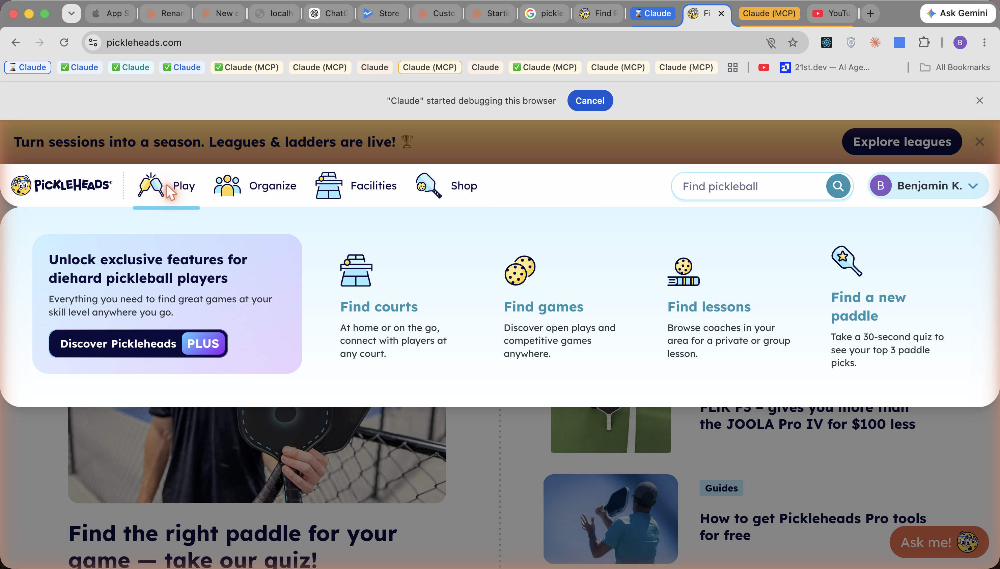

### Organize mega-menu
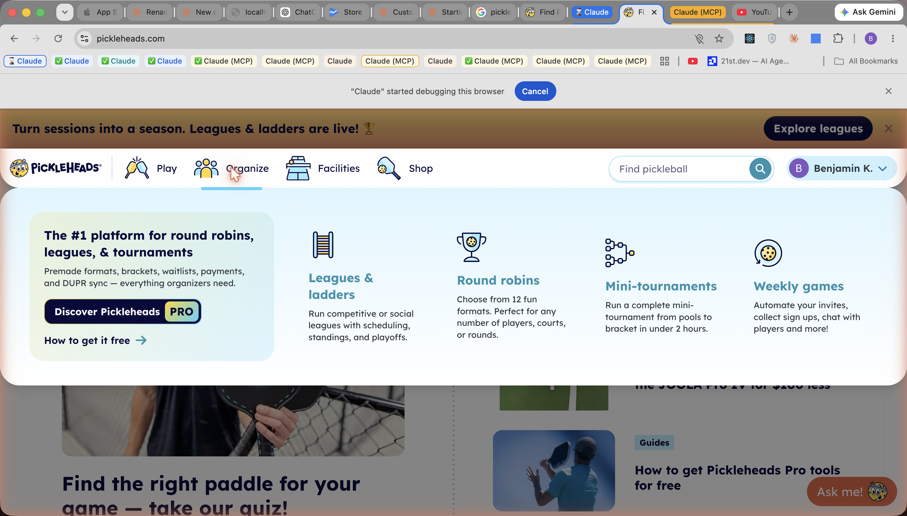

### Facilities mega-menu
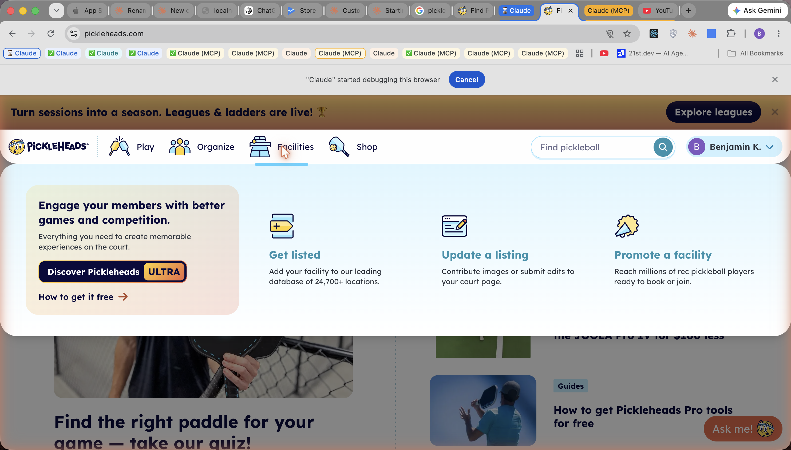

### Shop mega-menu
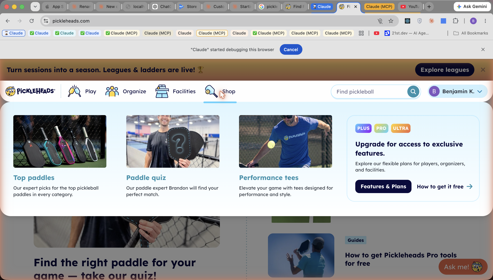

The header also contains a global **"Find pickleball" search** (typeahead, described in §5) and the **account avatar menu** (§11). A sitewide promotional banner ("Turn sessions into a season. Leagues & ladders are live! 🏆 — Explore leagues") runs above the nav and is dismissible.

---

## 4. The Homepage

**URL:** `/` · **Title tag:** *"Find Pickleball Courts, Games & Groups | Pickleheads"*

The homepage is a long, modular landing page that simultaneously serves first-time visitors (utility + social proof) and search engines (location directory + content links). Its sections, top to bottom:

### 4.1 Hero & local snapshot
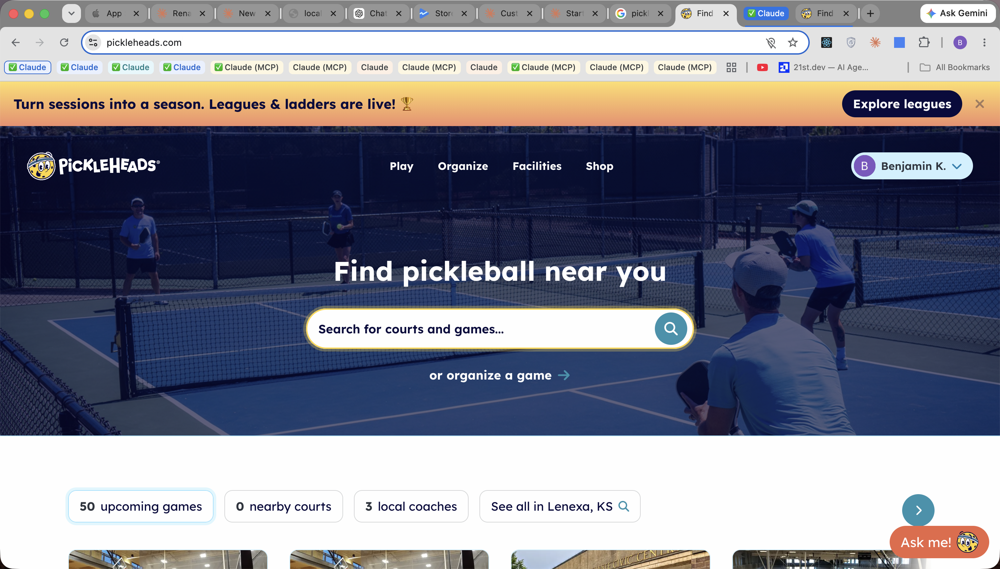

A full-bleed court photo backs the hero search ("Search for courts and games…"). Immediately below sit **geolocated quick-stat chips** personalized to the visitor's detected city — in this session: **"50 upcoming games," "0 nearby courts," "3 local coaches," "See all in Lenexa, KS."** A horizontally scrolling rail then previews actual upcoming open-play sessions (date, time, "Open Play at [venue]"). This pattern instantly proves the platform has live, local inventory.

### 4.2 App download + endorsements
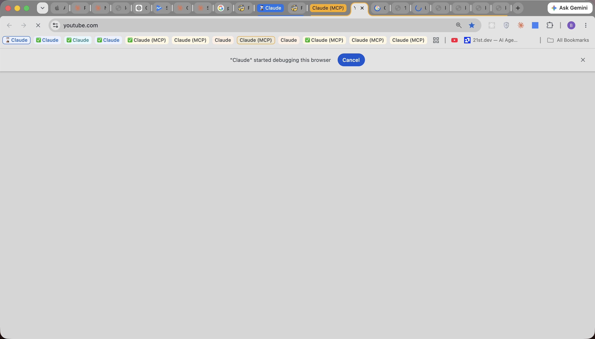

A **"Download the #1 app for pickleball"** band (App Store + Google Play badges, "4.9 – 9200+ reviews") is followed by an **"Endorsed by leading pickleball organizations"** logo wall: IAPF, Pickleball Consulting Group, SFIA, Pickleball Brief, Pickleball Expositions, **USA Pickleball**, and the **Global Pickleball Federation**. This is high-authority social proof aimed at organizers and facilities.

### 4.3 Pro / organizer showcase
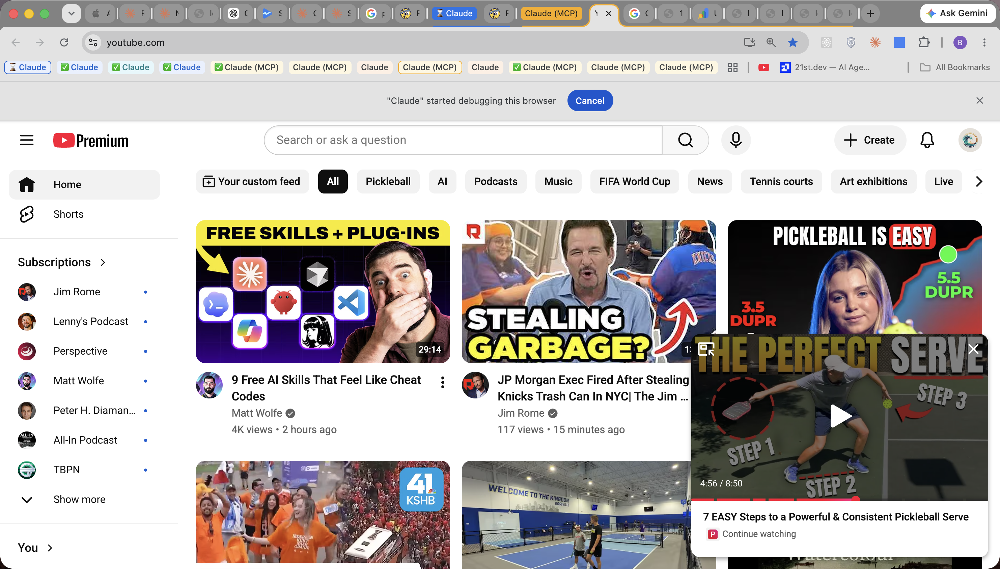

**"The #1 platform for round robins, leagues, and tournaments"** highlights *Automate weekly invites, Seamlessly collect payments, Integrated with DUPR*, with CTAs to **"Explore all the features"** and **"Try a test round robin."** A live-looking leaderboard mock (player standings with records and rating deltas) reinforces the competition tooling.

### 4.4 Learn & gear content
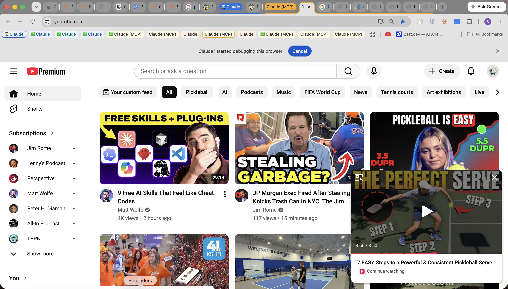

Two content blocks drive SEO and affiliate revenue: **"Learn to play pickleball with our how-to guides"** (9 simple rules, skill-rating quiz, how to run a flex league, a free virtual beginner clinic video) and **"Up your game with gear guides & reviews"** (Best paddles, advanced/power/spin paddles, a **"Find the right paddle — take our quiz"** CTA, and review cards).

### 4.5 Programmatic location directory
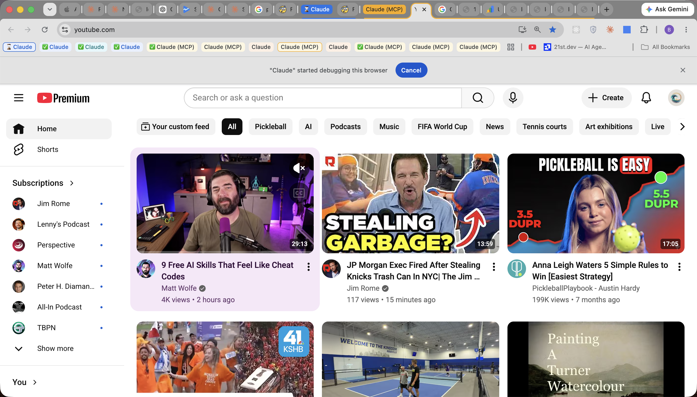

**"Find courts, games, and lessons wherever you go"** is a tabbed directory — **Cities · States · Countries · Court Types · Amenities** — surfacing city cards each showing **Locations / Courts / Games** counts (Toronto: 158 locations, 454 courts, 511 games; Houston, Chennai, Chicago, Ottawa, NYC, San Diego, Singapore, Seattle…). This is the human-facing entry point into the programmatic SEO graph and a major internal-linking hub.

### 4.6 FAQ, community stats & footer
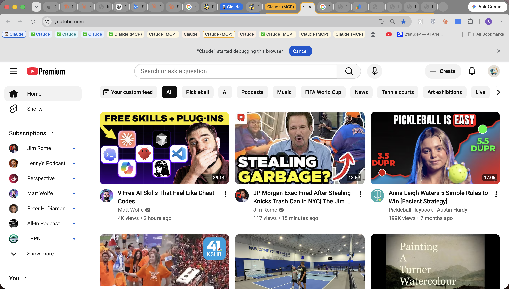

A large **FAQ accordion** (~19 questions covering "What is Pickleheads," running round robins/leagues/ladders/tournaments, collecting payment, finding courts, Pro, pricing, adding/updating courts, equipment, learning) feeds long-tail SEO and FAQ structured data. A headline stat band closes the page: **698,700 members · 4,284,500 games · 24,700 locations · 9,800 cities.**

The footer is an information-architecture map in itself, with four link columns — **Pickleheads** (Support & Feedback, Add a Location, Player Tutorials, About Us), **Upgrade** (Pricing & Features, Plus for Players, Pro for Organizers, Ultra for Facilities), **Guides** (Run a League, Run a Ladder, Run a Mini-Tournament, All Blog Posts), and **Organize** (Video Series, Organizer Toolkit, Manage Groups, Collect Payments) — plus social icons (Facebook, Instagram, TikTok, X, YouTube), legal links (Accessibility, Terms, Privacy, Cookie, Payment Terms, Refund, Community Guidelines, "Do Not Sell or Share My Personal Information"), and the corporate mark **"Pickleheads® © 2026 Dink Technologies, Inc."**

---

## 5. Search & Discovery — The Court/Game/Lesson Finder

This is the most-trafficked utility in the product and the core of the consumer experience.

### 5.1 Typeahead search
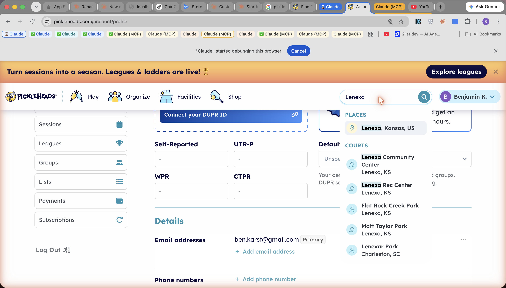

The global search is a categorized typeahead that segments results into **PLACES** (cities/regions, e.g. "Lenexa, Kansas, US") and **COURTS** (named venues with city subtitles). Selecting a place routes to the map-based finder.

### 5.2 The map finder (Courts mode)
**URL pattern:** `/search?q=…&lat=…&lng=…&z=…` (also reachable as a location-scoped view at `/courts/us/<state>/<city>`)

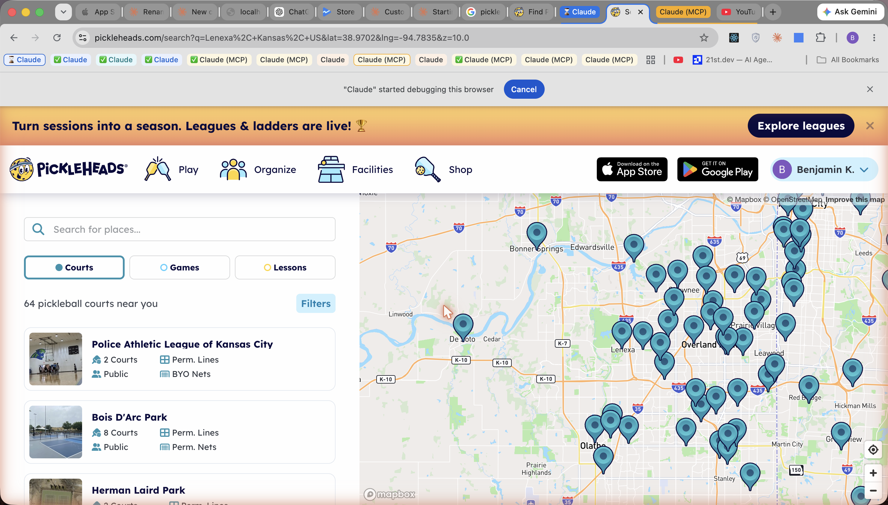

A classic **split list+map** layout (Mapbox GL on the right, results list on the left). The header offers a three-way mode toggle — **Courts · Games · Lessons** — a "Search for places…" box, a result count ("64 pickleball courts near you"), and a **Filters** button. Court cards show a thumbnail, name, court count, access (Public), and net/line info (Perm. Lines, BYO Nets, Perm. Nets). Map pins are clustered and clickable.

### 5.3 Filters
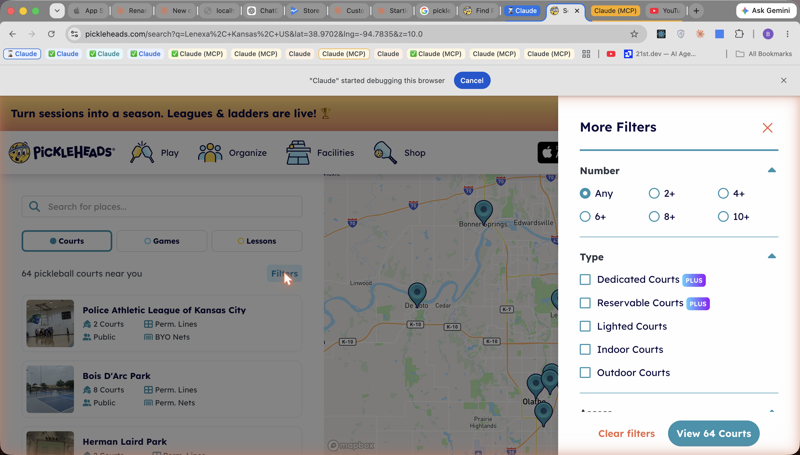

A slide-out **More Filters** drawer exposes rich facets, several of them **gated behind Plus** (a clean monetization wedge inside discovery):

- **Number** of courts: Any / 2+ / 4+ / 6+ / 8+ / 10+
- **Type:** Dedicated Courts `PLUS`, Reserved Courts `PLUS`, Lighted, Indoor, Outdoor
- **Access**, **Amenities** (Trainers & Lessons, Water, Wheelchair Accessibility, Youth Programming, Adaptive Programming), and **Surface** (Wood, Concrete, Asphalt, Carpet, …)

### 5.4 Games mode (date-scoped open play)
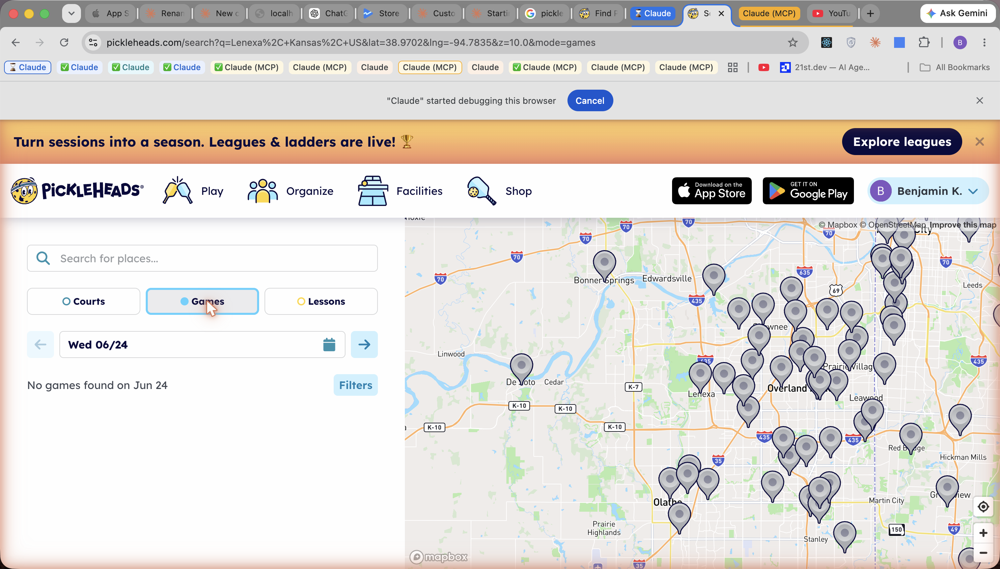
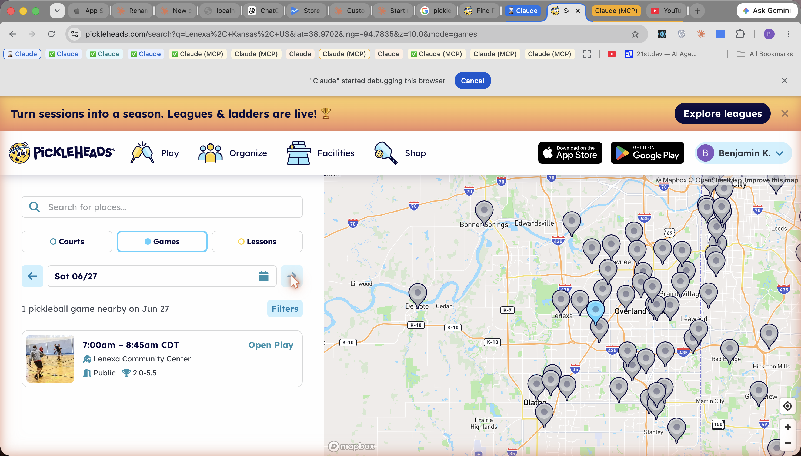

Switching to **Games** (`&mode=games`) adds a **date stepper** (prev/next + calendar picker) and filters the map to sessions on the chosen day. Each game card shows time + timezone, type (**Open Play**), venue, access, and a **skill range** (e.g., 2.0–5.5). Empty days say "No games found on [date]."

### 5.5 Lessons mode (coaching marketplace)
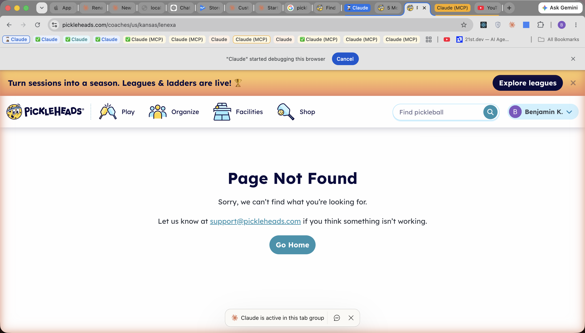

**Lessons** mode (`&mode=lessons`) is **"Powered by TeachMe.To"** — a partner integration. It lists coaches near the location with photo, home court, **star rating + review count** (Max Johnson, 5.0, 27 ratings), and a **"$57+ per lesson"** price-from. A persistent **"Are you a pickleball coach? Get listed here!"** lead-gen CTA invites supply-side signups.

---

## 6. Court / Facility Detail Page

**URL pattern:** `/courts/us/<state>/<city>/<court-slug>` · **Title tag:** *"Play Pickleball at [Court]: Court Information | Pickleheads"*

This is the platform's SEO crown jewel and the densest single page in the product — a fully-templated "everything about this place to play" hub that aggregates static facts, live community data, schedules, weather, coaching, and internal links.

### 6.1 Header & facts
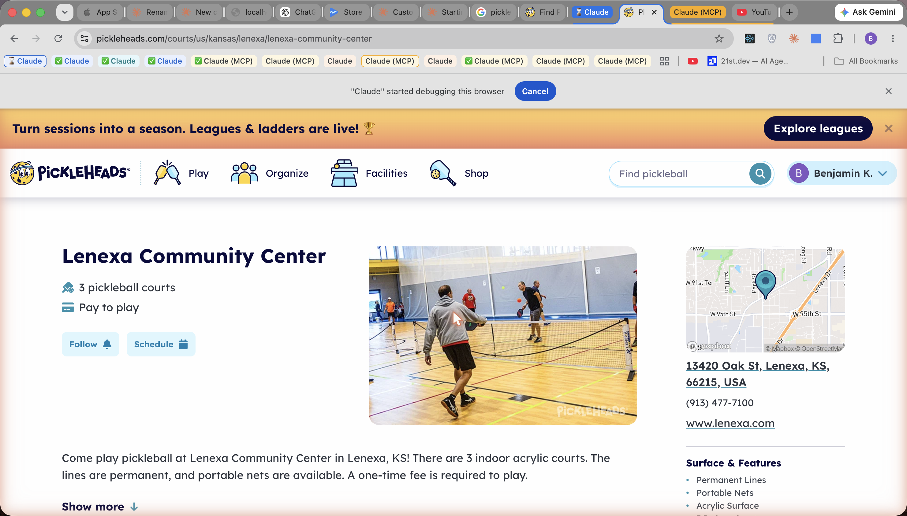

The header carries the court name, court count, a pay/free badge ("Pay to play"), **Follow** and **Schedule** actions, a hero photo (Pickleheads-watermarked), and a sidebar with an embedded map, full address, phone, and website. A natural-language description ("Come play pickleball at Lenexa Community Center… 3 indoor acrylic courts… A one-time fee is required to play.") sits above a **Surface & Features** list (Permanent Lines, Portable Nets, Acrylic Surface, 3 Indoor Courts). A **"See a mistake? Suggest an edit"** link invites crowdsourced corrections.

A community band — **"Connect with 43 players at this location — Follow now to chat and get invited to games"** — surfaces aggregate stats: **4 Games · 43 Players · 1 Group · 3 Coaches**.

### 6.2 Weekly schedule
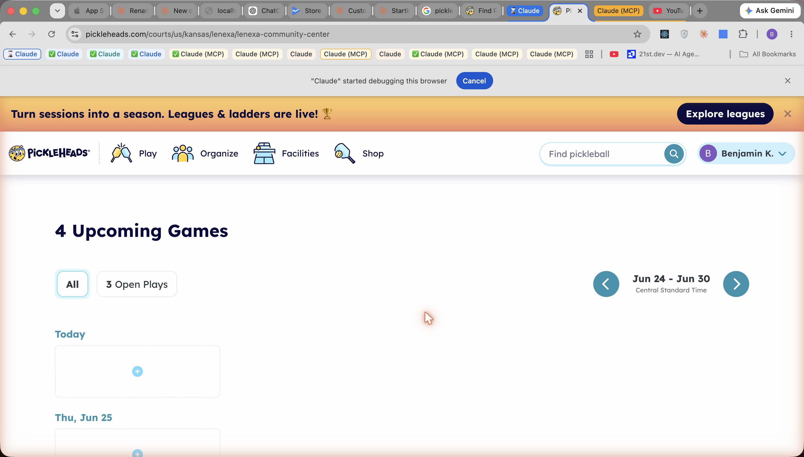

An **"Upcoming Games"** module renders a day-by-day week grid (Today → next 6 days) with an **All / Open Plays** filter, week pagination, timezone label, and per-slot times + skill ranges. Empty days expose a **"+"** affordance to add a session, turning every court page into an organizer on-ramp.

### 6.3 Players & groups (Plus paywall)
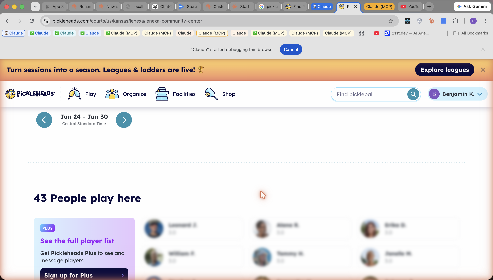

**"43 People play here"** and **"1 Group plays here"** render partially blurred rosters behind a **`PLUS` paywall**: *"See the full player list — Get Pickleheads Plus to see and message players — Sign up for Plus."* Visible cards tease names + skill ratings (e.g., Leonard J. 3.0). The group card shows name, public/private, skill band, and member count (Eastern Mountain Top Pickleball Club, Public, 2.0–2.5, 125). This is the platform's sharpest free→paid conversion mechanic: discovery is free, but *connection* costs Plus.

### 6.4 Lessons, weather & FAQ
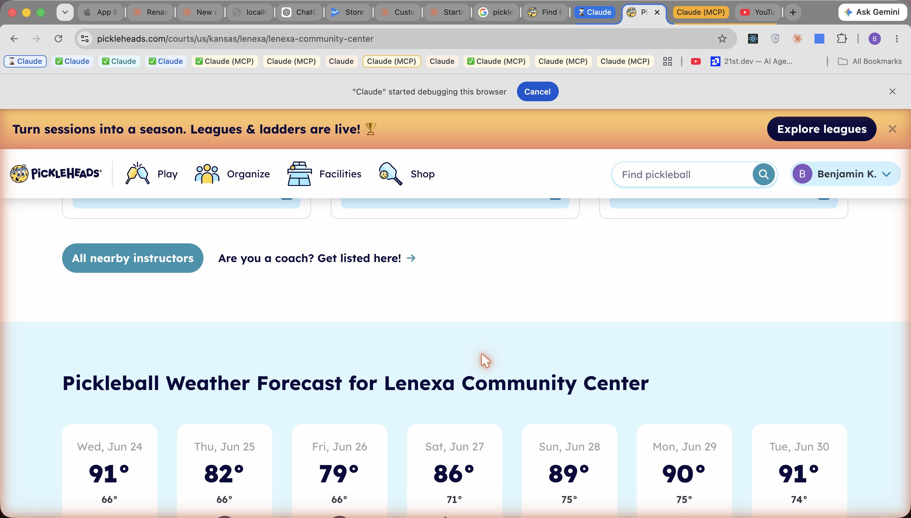

A **"Take pickleball lessons nearby"** rail lists coaches (rating, review count, "$57+/$86+ per lesson," **Schedule a lesson**) with an "Are you a coach? Get listed here!" CTA. A standout utility is the **7-day "Pickleball Weather Forecast"** (high/low, conditions, wind, precip %) — a high-intent, share-worthy feature unique among court directories. A court-specific **FAQ** ("How many courts…," "Do I have to bring my own chalk and net…," "Is it free…," "Can you reserve…") feeds FAQ structured data.

### 6.5 Internal-linking footer
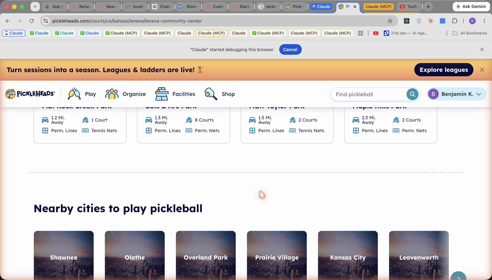

Every court page ends with **"Nearby courts"** (name, distance, courts, net type) and **"Nearby cities to play pickleball"** (city cards with location/court/coach counts). This dense, reciprocal internal linking is the backbone of the programmatic SEO graph (§13).

---

## 7. Session / Open-Play Detail Page

**URL pattern:** `/sessions/<id>/<n>` · **Title tag:** *"Open Play at [Court] - 6/27 at 7:00 AM | Pickleheads"*

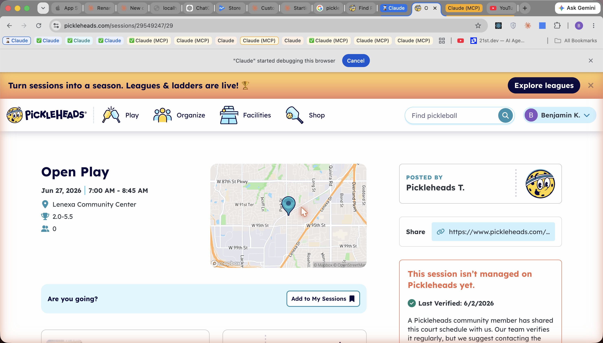

Each game/session is a first-class, indexable page. It shows the session type ("Open Play"), date, time window, venue, skill range, attendee count, and an embedded map. Core actions:

- **"Are you going? → Add to My Sessions"** (RSVP / save).
- **Posted by** attribution (here, "Pickleheads T." — a system/community poster) and a copyable **Share** URL.
- A **trust module**: *"This session isn't managed on Pickleheads yet — Last Verified: 6/2/2026 — A Pickleheads community member has shared this court schedule with us. Our team verifies it regularly, but we suggest contacting the court directly."*
- A **crowdsourced verification** prompt — *"Does this schedule look correct? → Yep, looks good to me! / Nope, I see a problem"* — which keeps directory data fresh.
- Linked **court card** (3 Courts, Perm. Lines, Fee, Portable Nets) and a **live weather** chip (72°, Partly Cloudy, 10 mph).

This page elegantly bridges *unmanaged crowdsourced data* and *managed Pickleheads-hosted sessions*, with the verification UX nudging the former toward the latter.

---

## 8. Location Directory Pages (City / State / Country)

**URL pattern:** `/courts/us/<state>/<city>` · **Title tag:** *"5 Most Popular Pickleball Courts in Lenexa, KS | Pickleheads"*

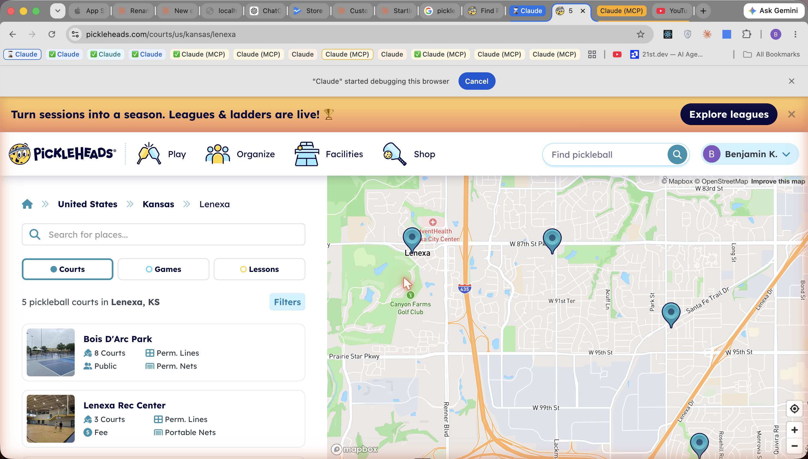

City pages reuse the list+map finder but wrap it in **SEO scaffolding**: a breadcrumb trail (**Home » United States » Kansas » Lenexa**), an H1/title with the city's court count, the Courts/Games/Lessons toggle, and the same nearby-cities interlinking. The identical template scales to ~9,700 cities, ~750 states, and ~145 countries (each also in a "-lessons" variant), forming a clean geographic hierarchy that mirrors how people search ("pickleball courts in [city]").

---

## 9. Organizer Suite — Leagues, Ladders, Round Robins & Tournaments

The "Organize" surface is where Pickleheads becomes a vertical SaaS. These are marketed via rich product pages and delivered primarily through the mobile app.

### 9.1 Leagues & Ladders
**URL:** `/leagues` · **Title:** *"Pickleball Leagues and Ladders on Autopilot | Pickleheads"*

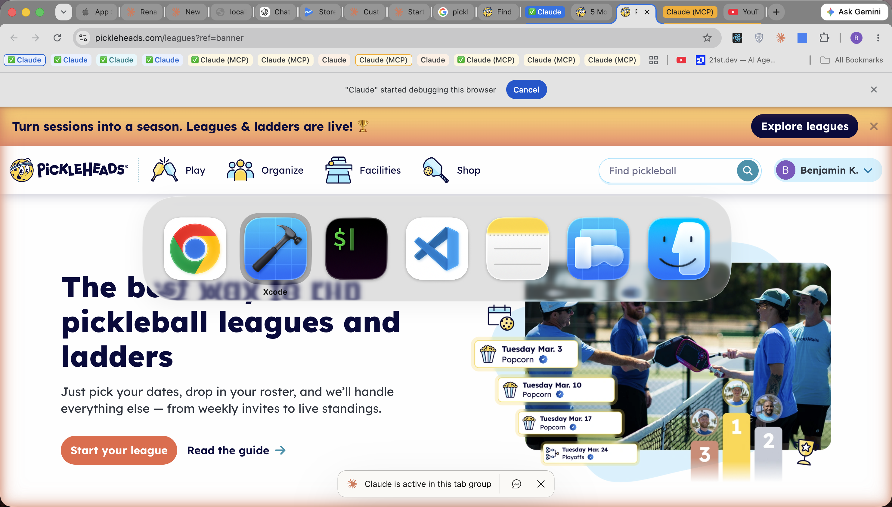

Pitch: *"Just pick your dates, drop in your roster, and we'll handle everything else — from weekly invites to live standings."* The flow is: **Create a league/ladder → Automate the hard stuff → Build with any format → View & share live standings → End with a playoff bracket.**

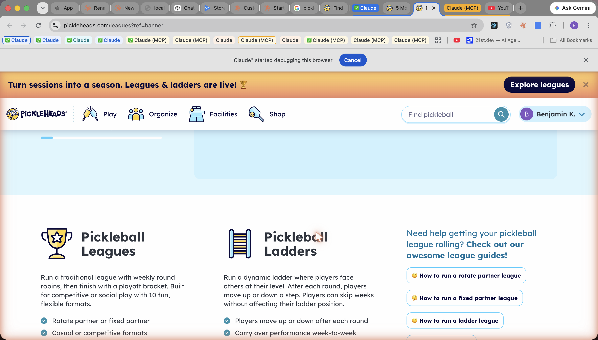

- **Leagues:** traditional weekly round robins finishing with a playoff bracket; 10 flexible formats; rotate or fixed partner; casual or competitive.
- **Ladders:** dynamic, continuous play where players move up/down a step each round, can skip weeks without penalty, and carry performance week-to-week.

Feature depth observed: automated rosters & weekly auto-invites; **12 round-robin formats**; **live standings** that players see in-app and organizers can use to **seed** the next event; **playoff brackets up to 32 teams** with custom seeding and consolation brackets; flexible handling of late arrivals, guests, and on-the-fly court/player changes; **DUPR integration** (require DUPR ID to register, one-tap score submission, automatic validation); **pickleball-native chat** (group, broadcast to confirmed players, DMs); and **payment collection** (Apple Pay/Google Pay/cards, automated refund policies, stored payment methods).

### 9.2 Round Robin Tool
**URL:** `/round-robin` · **Title:** *"Try the #1 pickleball round robin tool | Pickleheads"*

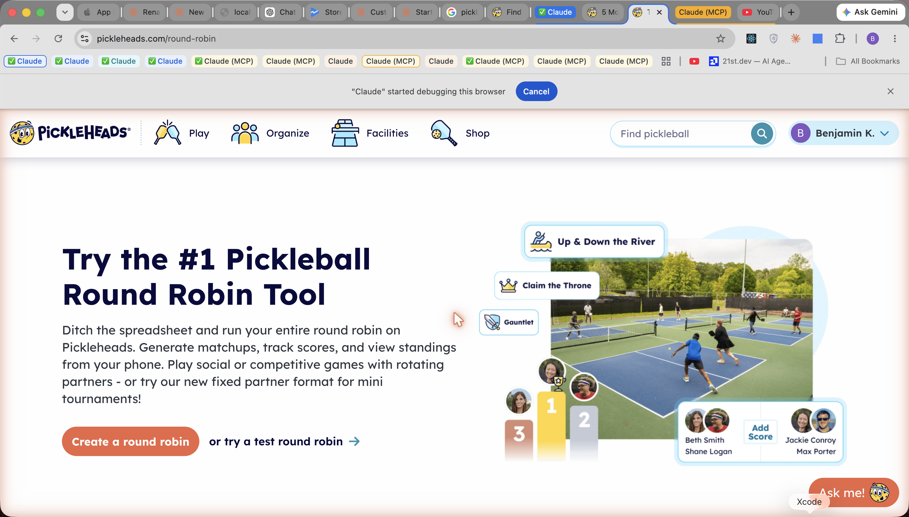

The flagship organizer feature: *"Ditch the spreadsheet… Generate matchups, track scores, and view standings from your phone."* Capabilities: **12 fun formats**, unlimited players & courts, late-arrival handling, everyone-can-enter-scores, live standings, DUPR submission, and a **format quiz** to help organizers choose. Named formats include **Popcorn, Gauntlet, Up & Down the River, Claim the Throne, Cream of the Crop, Double Header, Mixed Madness, Scramble, Rumble,** and **Pool Play**, across **Rotate** and (newer) **Fixed** partner modes. Each format has an explainer ("Popcorn… randomly generated unique matchups… hit Shuffle for a new draw"). The page also covers **mini-tournaments** (team sign-ups → pool play → championship bracket, up to 32 teams, court-space optimizer, completed in a couple hours) and **weekly games** (player limits + automatic waitlisting + guest tracking). A 10-minute **video series** and organizer testimonials (e.g., a facility running 60 players across 14 courts) round it out.

### 9.3 Mini-tournaments & Weekly games
Surfaced both in the Organize menu and within the round-robin page: **mini-tournaments** add championship/consolation brackets on top of pool play; **weekly games** focus on recurring sessions with set player limits, automatic waitlist promotion when someone drops, and guest tracking.

---

## 10. Coaching, Shop & Content

### 10.1 Coaching marketplace
Coverage of coaches appears in three places: the **Lessons** finder mode (§5.5), the **"Take lessons nearby"** rail on court pages (§6.4), and per-coach scheduling. Supply is **powered by TeachMe.To**, with Pickleheads supplying the high-intent local audience and lead-gen CTAs ("Are you a coach? Get listed here!").

### 10.2 Shop & gear (content + affiliate + merch)
The "Shop" menu spans three monetization models:

- **Editorial gear reviews** at `/pickleball-gear/...` — e.g., *"Best pickleball paddles in June 2026"* by Brandon Mackie, with an explicit **affiliate disclosure** ("we may earn an affiliate commission… Here's how it works"), a "Jump to" table of contents (Best overall/budget/power/spin/control/etc.), and breadcrumbs.

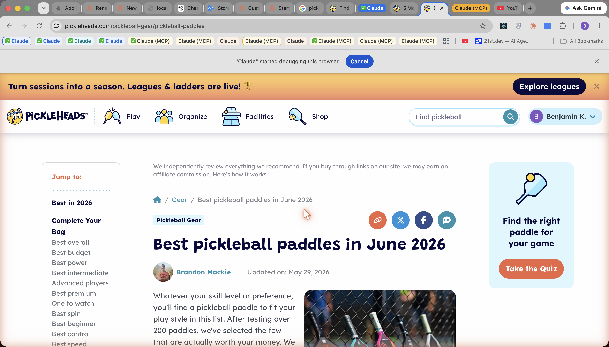

- **Paddle quiz** at `/paddle-quiz` — a "Find the right paddle for your game" recommender that captures intent and routes to affiliate products.
- **Merch store** at the external subdomain **`shop.pickleheads.com`** — branded "Performance tees" and apparel.

This content arm is a top-of-funnel SEO and revenue engine that is only loosely coupled to the core utility but heavily cross-linked from it.

---

## 11. Authenticated Member Experience

The account avatar opens a member menu spanning the full social/CRM surface.

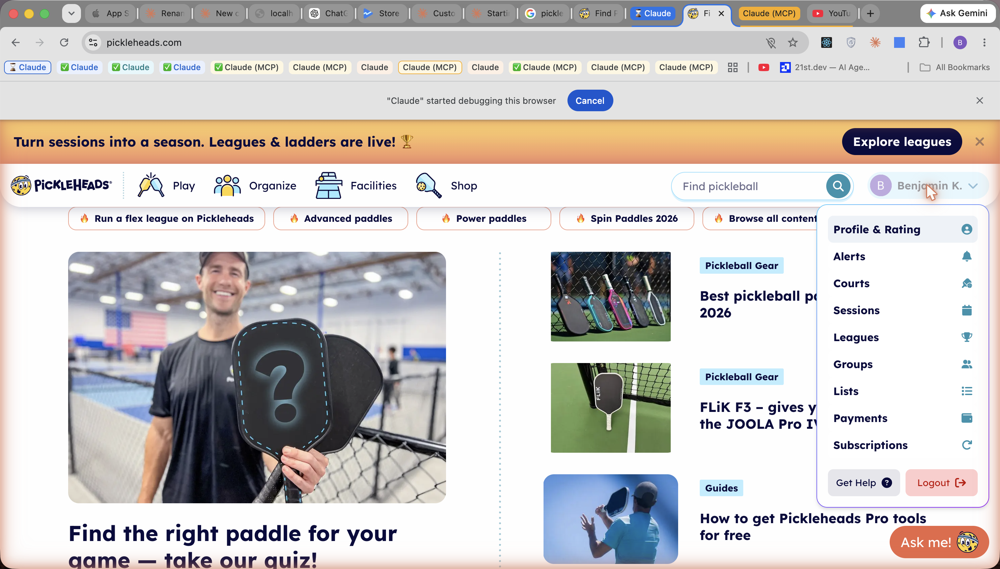

**Menu items:** Profile & Rating · Alerts · Courts · Sessions · Leagues · Groups · Lists · Payments · Subscriptions · Get Help · Logout. In aggregate these implement a player CRM: saved/followed **Courts**, RSVP'd **Sessions**, joined **Leagues**, **Groups** (clubs/communities), curated player **Lists**, **Payments** (methods + history for paid sessions), and **Subscriptions** (tier management).

### 11.1 Profile & Rating
**URL:** `/account/profile`

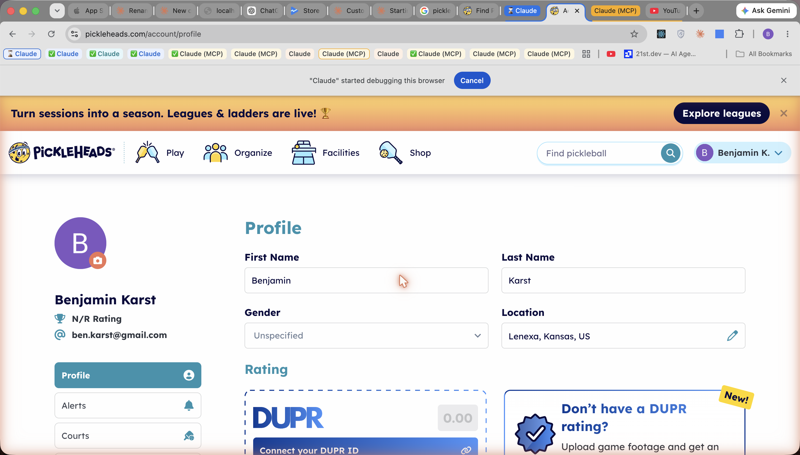

The profile captures name, avatar, gender, and location, and centers on a **multi-system skill rating** model.

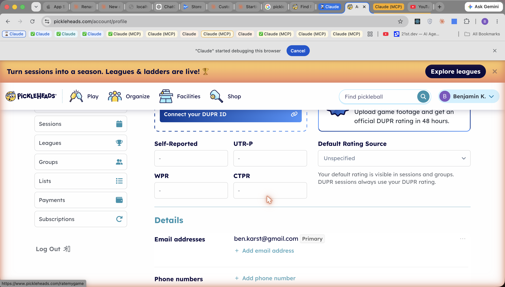

Supported rating sources: **DUPR** (deep integration — "Connect your DUPR ID," and a "Don't have a DUPR rating? Upload game footage and get an official DUPR rating in 48 hours" pathway), **Self-Reported, UTR-P, WPR,** and **CTPR**, with a configurable **Default Rating Source** ("DUPR sessions always use your DUPR rating"). Contact details support multiple emails (with a Primary) and phone numbers. Rating is the connective tissue that powers skill-matched game discovery, league seeding, and DUPR score submission.

---

## 12. Platform-Wide Feature Summary

Rolling the views above into a capability inventory:

**Discovery & directory**
- Worldwide court database with map (Mapbox), list, and rich filters (number, type, access, amenities, surface).
- Court detail pages with photos, amenities, address/phone/website, schedules, weather, FAQ.
- Open-play / game discovery by date and skill range.
- Coaching/lessons discovery (TeachMe.To).
- Crowdsourced data: add a location, suggest edits, verify schedules ("looks good / I see a problem").

**Social & community**
- Player profiles + multi-source skill ratings (DUPR/UTR-P/WPR/CTPR/self).
- Follow courts and players; "people who play here" rosters.
- Groups/clubs with membership and skill bands.
- Pickleball-native chat: group chats, broadcast to confirmed players, DMs.
- Curated player **Lists**; **Alerts/notifications**; session RSVPs ("Add to My Sessions").
- 7-day, court-specific weather forecasts.

**Organizer tooling**
- Round robins: 12 formats, rotate/fixed partner, unlimited players/courts, live standings, shuffle, timed-round guidance, spreadsheet export.
- Leagues (weekly round robin + playoff) and Ladders (continuous, move up/down).
- Mini-tournaments: pool play + championship/consolation brackets (up to 32 teams), court-space optimizer.
- Weekly recurring sessions with auto-invites, player limits, **automatic waitlisting**, guest tracking.
- Score entry by any player; real-time standings; champion crowning.
- **DUPR**: require ID at signup, one-tap submission, automatic score validation.
- **Payments** (Stripe): charge for spots, Apple/Google Pay + cards, stored methods, automated refunds.
- Shared organizer privileges; duplicate-a-session; advanced waitlist management.

**Facility tools**
- Get listed / claim / update a listing; promote a facility.
- Facility integrations (CourtReserve today; "more coming"; CourtReserve via Ultra add-on).
- Facility promotion add-on; in-app leagues & ladders; unlimited everything.

**Content & commerce**
- How-to-play guides, skill-rating quiz, blog, video series, free virtual clinic.
- Gear reviews (affiliate) + paddle-matching quiz; merch store.
- Coaching marketplace lead-gen.

**Cross-platform**
- Responsive web app + native iOS/Android apps (4.9★, 9,200+ reviews). The round-robin tool is explicitly **mobile-app-exclusive**, with web acting as discovery + marketing + directory.

---

## 13. Monetization & Business Model

Pickleheads runs a **freemium + marketplace + affiliate** model. The subscription ladder:

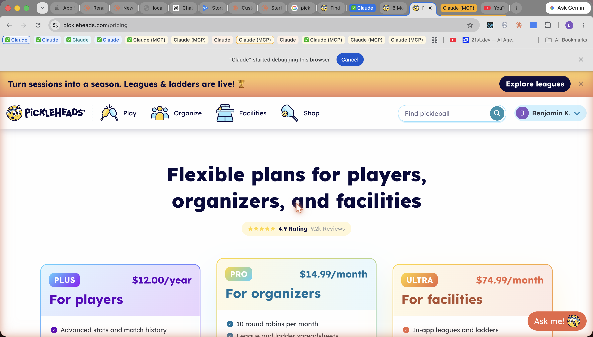

| Tier | Price | Audience | Headline value |
|---|---|---|---|
| **Free** | $0 | Everyone | Discovery, 2 round robins/mo, basic lists/guests |
| **Plus** | **$12.00 / year** | Players | Advanced stats, message players, skill-matched games, 7-day-out discovery, groups, Vacation Mode, unlimited 4-player round robins |
| **Pro** | **$14.99 / month** | Organizers | 10 round robins/mo, league/ladder spreadsheets, automated weekly sessions, advanced waitlists, 75 guest adds, all Plus |
| **Ultra** | **$74.99 / month** | Facilities | In-app leagues & ladders, unlimited round robins/guests, facility integrations, all Plus + Pro |

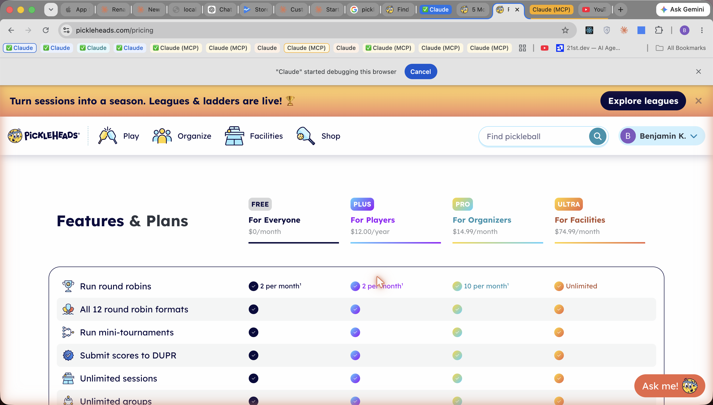

**Key model details captured from the comparison matrix and leagues pricing page:**

- **Round-robin metering:** Free & Plus = 2/mo, Pro = 10/mo, Ultra = unlimited; **extra round robins are $5 each.**
- **Guest adds:** 20/mo (Free/Plus) → 75/mo (Pro) → unlimited (Ultra).
- **Leagues/Ladders:** "Spreadsheets" on lower tiers vs. fully **in-app** on Ultra.
- **Facility add-ons:** **Facility Integration +$75** (currently CourtReserve), **Facility Promotion +$50**.
- **The "Plus-Power" growth loop:** Organizers can **"run unlimited leagues for FREE"** if their *players* each hold a Plus subscription — pitched as *"just ask your players to get Pickleheads Plus for just $1/month."* The alternative is the organizer self-covering via **Ultra**. This neatly converts organizer demand into a viral, player-funded subscription engine.

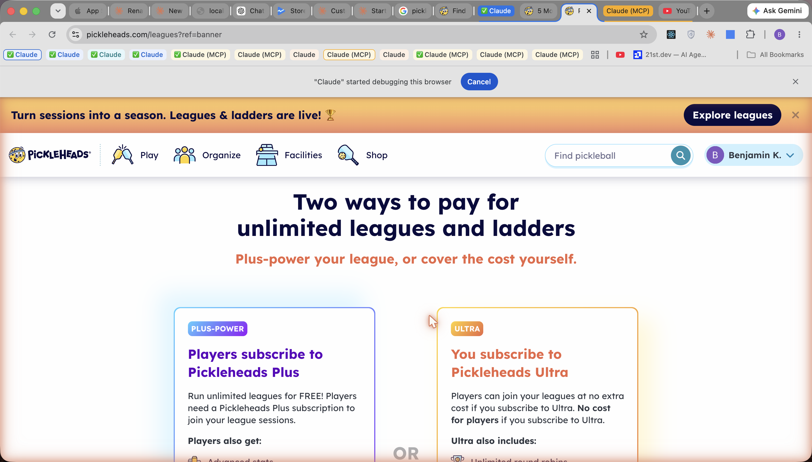

**Additional revenue lines:**
- **Affiliate commerce** on gear/paddle reviews and the paddle quiz.
- **Merch** via `shop.pickleheads.com`.
- **Coaching marketplace** via the TeachMe.To partnership.
- **Facility promotion** as paid placement.

A persistent *"How to get it free"* / *"Get Pickleheads Pro tools for free"* motif appears across menus and pages — a deliberate friction-reducer that pushes organizers into the player-funded loop rather than direct payment.

---

## 14. SEO Strategy

Pickleheads is, at its core, **a programmatic-SEO machine** — arguably the most sophisticated in the pickleball vertical. The strategy has five pillars.

### 14.1 Massive programmatic page generation
The sitemap index (`/sitemap.xml`) fans out into section sitemaps whose scale is the whole game:

| Section | Indexed URLs (observed) |
|---|---|
| Courts | **24,192** |
| Cities | **9,692** |
| Cities (lessons variant) | (separate sitemap) |
| Groups | **5,009** |
| States | **750** (+ states-lessons) |
| Countries | **145** (+ countries-lessons) |
| Marketing pages | 38 |
| Blog / Authors / Videos | dedicated sitemaps each |

Every court, city, state, country, and group is its own indexable, templated page — and most geographic levels also have a parallel **"-lessons"** sitemap, effectively doubling the geo footprint to capture "pickleball lessons in [place]" intent alongside "courts in [place]."

### 14.2 Clean, hierarchical URL & breadcrumb taxonomy
URLs mirror search intent and a strict geo hierarchy: `/courts/us/kansas/lenexa/lenexa-community-center`, with on-page **breadcrumbs** (Home » United States » Kansas » Lenexa » Court) reinforcing the tree for both users and crawlers.

### 14.3 Templated, keyword-aligned metadata
Observed on court pages: title *"Play Pickleball at [Court]: Court Information | Pickleheads,"* a benefit-rich meta description, **self-referencing canonical**, `robots: index,follow`, full **Open Graph** (`og:title/description/image/type`) and **`twitter:card=summary_large_image`**. `og:image` is generated on the **Filestack CDN** with dynamic resize params (`resize=w:1200,h:630`), giving every page a correctly-sized share card.

### 14.4 Structured data for rich results
Court pages embed **JSON-LD `FAQPage`** schema (Question/Answer pairs) — eligible for FAQ rich results — and the breadcrumb/listing patterns support additional structured markup. The pervasive FAQ accordions (homepage, court pages, product pages) are as much a structured-data play as a UX one.

### 14.5 Internal linking, freshness & content marketing
- **Dense reciprocal interlinking:** every court links to nearby courts and nearby cities; every city links to its courts and neighboring cities; the homepage directory links into the top of the graph.
- **Freshness signals:** date-stamped schedules, "Last Verified" dates, *month-stamped* content ("Best paddles in June 2026"), and live weather all create perpetually-updating pages.
- **Content hub:** how-to guides, gear reviews, author pages (E-E-A-T via named author Brandon Mackie), and a video series target informational queries up-funnel.

### 14.6 Crawl management
`robots.txt` explicitly **`Disallow`s** non-SEO and transactional surfaces — `/api/`, `/search?*`, `/lessons?*`, `/login`, `/signup`, `/paddle-quiz/*`, `/courts/edit`, `/courts/new`, `/complete-stripe-payment`, `/round-robin-simulator?*`, embeds, etc. — focusing crawl budget on the indexable directory while keeping dynamic/duplicate parameter URLs out of the index. Notably it **explicitly `Allow`s `meta-externalagent`** (Meta's AI crawler), an intentional choice about AI-era discoverability.

---

## 15. Technical Architecture & Stack

Observed from the rendered app, network calls, and headers:

- **Framework:** **Next.js / React** — confirmed via `window.__NEXT_DATA__`, the `#__next` root, a `buildId`, and `/_next/static/chunks/...` bundles (polyfills, webpack, framework). Pages are server-rendered/statically generated for SEO. *(Note: the host repo's `AGENTS.md` flags a heavily-customized Next.js; the public site is unmistakably Next.js-based.)*
- **Edge/CDN & security:** **Cloudflare** fronts the site (raw non-browser requests are challenged with "Attention Required! | Cloudflare"); static assets and share images are served via CDN, with images through **Filestack** (`cdn.filestackcontent.com`) using on-the-fly transforms.
- **Maps:** **Mapbox GL** (with OpenStreetMap data attribution) powers all list+map finders and embedded mini-maps.
- **Payments:** **Stripe** (`js.stripe.com`) — Apple Pay, Google Pay, and cards, with stored methods and automated refunds; a dedicated `/complete-stripe-payment` route.
- **Analytics/tag management:** **Google Tag Manager** (`googletagmanager.com`).
- **Ratings integration:** **DUPR** API (ID linking, score submission/validation, footage-to-rating pipeline).
- **Coaching integration:** **TeachMe.To** for lessons supply.
- **Native apps:** iOS + Android (the round-robin engine is app-exclusive); strong app-install CTAs throughout web.
- **Accessibility:** an accessibility overlay/widget is present (announced in the DOM), plus a dedicated Accessibility page and "Do Not Sell or Share My Personal Information" (CCPA) link.
- **Conversational help:** an **"Ask me!"** chat assistant widget (the routes `/ai-chat` and `/chat` exist and are disallowed in robots.txt), indicating an AI/support chat layer.

---

## 16. Trust, Data Quality & Community Mechanics

Because the directory began as crowdsourced data, Pickleheads invests heavily in **trust UX**: per-session "Last Verified" dates with disclaimers, one-tap **"looks good / I see a problem"** verification, **"Suggest an edit"** on court facts, **"Add a Location"** contributions, and clear labeling of unmanaged vs. Pickleheads-managed sessions. Combined with **Community Guidelines**, robust legal pages, and the endorsement wall, these mechanics build the credibility a global directory needs while continuously refreshing data at near-zero marginal cost.

---

## 17. Competitive Positioning & Notable Differentiators

What separates Pickleheads from generic court-finders and from pure organizer apps:

1. **Two-sided depth:** it is simultaneously the best consumer *finder* and the best organizer *toolkit*, with the directory feeding the SaaS and vice versa.
2. **Programmatic SEO moat:** tens of thousands of high-quality, interlinked, structured-data pages give it dominant organic visibility for "[city] pickleball" queries.
3. **Player-funded growth loop:** the $1/mo Plus-Power model turns organizer demand into viral player subscriptions.
4. **Format richness:** 12 round-robin formats + leagues + ladders + mini-tournaments is far deeper than competitors.
5. **Ecosystem integrations:** DUPR (ratings), Stripe (payments), Mapbox (maps), TeachMe.To (coaching), CourtReserve (facility reservations).
6. **Delightful utility extras:** per-court 7-day weather forecasts, the paddle quiz, and the playful mascot/brand voice.

---

## 18. Appendix

### 18.1 Observed URL patterns
| Surface | URL pattern |
|---|---|
| Home | `/` |
| Search finder | `/search?q=&lat=&lng=&z=&mode=courts\|games\|lessons` |
| City directory | `/courts/us/<state>/<city>` (`?mode=lessons` for coaches) |
| Court detail | `/courts/us/<state>/<city>/<court-slug>` |
| Session detail | `/sessions/<id>/<n>` |
| Leagues marketing | `/leagues` |
| Round robin marketing | `/round-robin` |
| Pricing | `/pricing` · Plus-Power: `/plus-power` |
| Gear/reviews | `/pickleball-gear/<topic>` · Paddle quiz: `/paddle-quiz` |
| Merch store | `https://shop.pickleheads.com` |
| Account | `/account/profile` (+ alerts, courts, sessions, leagues, groups, lists, payments, subscriptions) |
| Sitemaps | `/sitemap.xml` → `?section=pages\|blog\|authors\|countries\|states\|cities\|courts\|groups\|videos` (+ `-lessons` variants) |

### 18.2 Key metrics (as advertised, 2026)
- 698,700 members · 4,284,500 games · 24,700 locations · 9,800 cities · 4.9★ / 9,200+ app reviews.
- Sitemap scale: 24,192 courts · 9,692 cities · 5,009 groups · 750 states · 145 countries.

### 18.3 Screenshot index
All screenshots referenced above are stored in `spec/screenshots/` (`01`–`34`), covering: homepage sections (01–07), the four nav mega-menus (08–11), the account menu and profile (12–14), search/finder and filters (15–19), session detail (20), court detail (21–25), city directory (26), leagues (27–29), round robin (30), pricing (31–32), lessons (33), and gear/shop (34).

---

*Prepared as a competitive feature reference. All product names, prices, and statistics reflect what was publicly displayed on pickleheads.com during the capture session and are subject to change by the vendor.*
